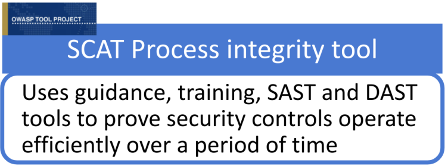
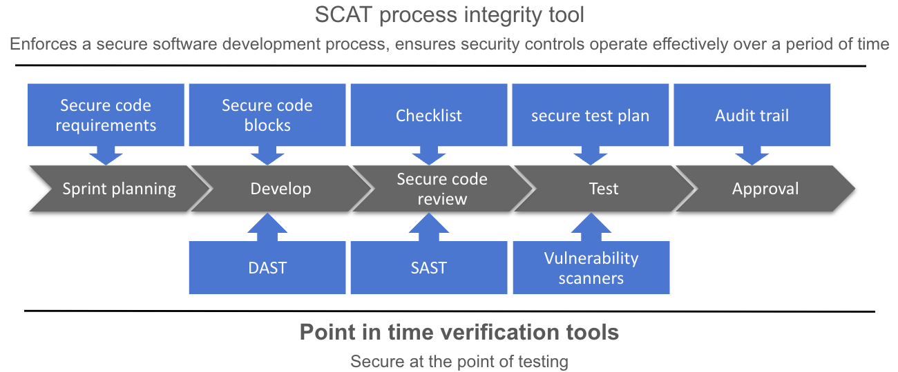

<figure>
 
  <figcaption>Process integrity tool</figcaption>
</figure>

<ol>
      <li>What is the SCAT process integrity tool and how does it work</li>
      <li>See how development teams use the SCAT process integrity tool </li>
      <li>Customising the SCAT process integrity tool to your development environment.</li>
      <Li><a href="https://www.linkedin.com/pulse/secure-code-assurance-tool-scat-version-20-michael-bergman/">For more information on the <b>why</b> behind the SCAT, read my linkedIn Article here.</a> </li>
   </ol>

   <h1>What is the SCAT process integrity tool and how does it work</h1>
   <h2>What</h2>
       <li> Writing secure code is only one of the five esential security components that comprise a "Secure Software development process.</li>
       <li> The five esential security components of a "Secure Software development process are:</li>
       <ol>  
           <li>Security governance: Consistant and predictable output, where teams know what to do and when it must be done.</li>
           <li>IT risk management: Defined criticality and priority.</li>
           <li>Security requirements: In proportion to criticality.</li>
           <li>Writing secure code: Correctly and completely implementing the security requirements.</li>
           <li>Assurance: Evidence of correct and complete implemention.</li>
       </ol>
       <li>SCAT functions as a process integrity tool to overlay the SDLC and implement these esential security components.</li>
   
   
   <h2>How</h2>
      <li>SCAT process integrity tool enforces a Secure software development process and enables development teams to build, verify and assure secure software.</li>
      <ol>  
          <li><strong>Build</strong>: Integrates a combination of code level guidance and on demand training to define the security requirments before development begins and guide software developers towards its correct implementation.</li>
          <li><strong>Verify</strong>: Integrates point in time security verification tools to verify that the security requirments are met.</li>
          <li><strong>Assure</strong>: Integrates an audit trail to centrally store evidence of secure development and testing. Providing traceability through requirements and proving that security requirements were implemented correctly and will operate efficiently over a period of time.</li>
      </ol>
    <figure>
</figure>

   <h1>See how development teams use the SCAT process integrity tool</h1>
   <h2>Sprint planning phase</h2>
   
<b>Objective</b>: Generate security requirements before development begins and ensure they are understood 

   <li><b>Developers</b> use the <b>Identify risks</b> screen to </li>
   <ol>
      <li>Select the critical function to developing/changing</li>
      <li>Identify the technologies used</li>
      <li>Automatically generate the security requirements and tests</li>
   </ol>
   <li><b>Product owners</b> use the <b>Secure code requirements</b> screen to 
   <ol>
     <li>Create an audit trail, where the development team will stores evidence proving that the security requirements were met.</li>
     <li>Create Jira tickets assigning the security requirements and its accompaning evidence collection tasks to the development teams.</li>
  </ol> 
  <a href="https://youtu.be/Gpk4K5keLyw">See how to use the tools and its internal mapping to generate security requirements</a>

 
  <h2>Development phase</h2>
  
<b>Objective</b>: Ensure correct implementation of security requirements 

  <li><b>Developers</b> use the <b>Secure development</b> screen to 
    <ol>
       <li>View and understand how to attack and prevent the risk</li>
       <li>View the secure code requirements</li>
       <li>View the secure code block to implement the security requirement</li>
       <li>Manage development effort in Jira</li>
       <li>After development run a ZAP basic scan to verify security requirements have been correctly implemented</li>
    </ol>
   
<a href="https://youtu.be/1pSatE_7mEs">See how the tool helps developers understand security requirements and write secure code</a>
</li>

<h2>Secure code review phase</h2>

<b>Objective</b>: Ensure correct implementation of security requirements 

<li><b>Code reviewers</b> use the <b>Secure code review </b> screen to 
<ol>
    <li>Guide manually secure code review</li>
    <li>After manual secure code review run a Sonarqube scan to verify security requirements have been correctly implemented</li>
</ol>

<a href="https://youtu.be/ygre0SrWxD4">See how the tool verifies correct security requirements implementation</a>
</li>

<h2>Testing phase</h2>

<b>Objective</b>: Ensure valid security testing 

<li><b>Testers</b> use the <b>Secure testing</b> screen to 
<ol>
<li>View the test plans required to test the risk</li>
<li>Manage testing effort in Jira</li>
</ol>
 
<a href="https://youtu.be/QdbCzheceUw">See how the tool helps testers test risk mitigation efforts</a>
</li>

<h2>Approval phase</h2>

<b>Objective</b>: Streamline the approval and audit process 

<li><b>Approvers</b> use the <b>Assurance evidence </b> screen to 
<ol>
<li>View relevant testing evidence alongside the risk, reducing the time assurance teams need to examine and approve releases</li>
<li>View verified development effort and whether it falls within risk tolerance levels</li>
</ol>

<a href="https://youtu.be/oyKK3Mq13B4">See how the tool streamlines the approval process with centrally stored testing evidence</a>
</li>

<h2>Risk management</h2>

<b>Objective</b>: Enable risk managers to prioritise, plan and monitor mitigation efforts 

<li><b>Risk managers</b> use the <b>Application risk exposure</b> screen to 
<ol>
<li>View each application critical function and the associated risks</li>
<li>Identify where mitigation effort is required by viewing which risks require security requirements</li>
<li>Identify where development effort is required by viewing which security requirements need secure code blocks</li>
<li>Identify where extra testing effort is required by viewing which risks require security test plans</li>
</ol>

<a href="https://youtu.be/8pKxorPSq_M">See how the Application landscape overview screen informs risk based decision making</a>
</li>

 

<h1>Preparation phase</h1>

When developing secure software we need to consider both standard secure code and client specific architectural requirements

<h2>Standard secure code requirements</h2>
<li>SCAT comes out the box with a standard OWASP secure code requirements map. This mapping need to be modified to the specific organisation requirements</li>
<li>Information security and development team</b> use the <b>Internal mapping </b> screen to</li>
<ol>
<li>Map the security requirements to OWASP risks</li>
<li>Map organisation approved secure code blocks to security requirements</li>
<li>Map security test plans to OWASP risks</li>
</ol>

<a href="https://youtu.be/EkWdAC1sbkE">See how to setup the SCAT's internal mapping</a>

<h2>Client specific architectural requirements</h2>
<li>To generate these requirements we perform a risk assessment on client application landscape and identify</li>
<ol>
<li>Critical applications and functions</li>
<li>Risk associated with each critical application function</li>
<li>Architectural security requirements to secure each critical application functions</li>
<li>Client specific secure code blocks to implement security requirements</li>
<li>Secure test plans to verify risk has been mitigated</li>
</ol>

<li><b>Tool administrators</b> use the <b>Internal mapping </b> screen to</li>
<ol>
<li>Create json files of the organisation specific risks, security requirements, secure code blocks and tests</li>
<li>Import these into the SCAT</li>
</ol>

<a href="https://youtu.be/FD3O2ObYBQs">See how to import organisations specific risks, security requirements, secure code blocks and tests</a>

<h1>

Project information

</h1>
<h2>Licensing</h2>

This program is free software: you can redistribute it and/or modify it under the terms of the <a href="http://www.gnu.org/licenses/agpl-3.0.html">link GNU Affero General Public License 3.0</a> as published by the Free Software Foundation, either version 3 of the License, or (at your option) any later version.

<h2>Interested in contributing</h2>

<a href="https://www.linkedin.com/in/michael-bergman-99826212a/">Please send a connect request with subject SCAT</a>

<h2>Project Resources</h2>

[Installation Package]

[Source Code]

<h2>Project Leader</h2>

<a href="https://www.linkedin.com/in/michael-bergman-99826212a/">Michael Bergman LinkedIn</a>
</td>

